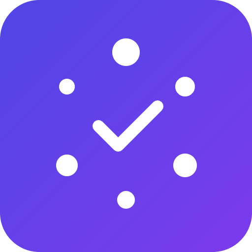

# Quorumly


AI-summarized, reputation-weighted governance voting for Solana DAOs.

## Overview

Quorumly is a governance dashboard for Solana DAOs. It uses AI to turn long, dense proposals into plain-language pros and cons, and it weights voting influence partly by on-chain reputation, not just token holdings. The goal is to fight voter apathy and reduce plutocratic capture in DAO governance.

## Problem

Low voter turnout and whale-dominated outcomes plague most on-chain DAOs. A big reason is that proposals are long and hard to parse, so most members either skip reading them or skip voting entirely. Meanwhile, voting power tied purely to token balance means a small number of large holders can decide outcomes regardless of how engaged they actually are.

## Solution

Quorumly combines AI-generated proposal summaries with a reputation score derived from on-chain voting and delegation history. Voting weight becomes a blend of token balance and reputation, so consistently active and effective participants have more influence, and proposals become quick to understand at a glance.

## Features (MVP)

- Fetch live proposals from Realms and summarize with AI
- Compute a reputation score from historical voting and delegation activity
- Blended voting weight combining token balance and reputation
- One-click vote casting directly from the summarized proposal view
- Delegate leaderboard showing the most active and effective voters

## Tech stack

Realms SDK, Anchor, OpenAI API, React, TypeScript, Postgres

## How it works

```
[Realms Proposals] --> [Realms SDK fetch] --> [OpenAI summarization]
                                                     |
                                                     v
[On-chain voting history] --> [Reputation engine] --> [Blended Vote Weight]
                                                     |
                                                     v
                                           [Dashboard: Summary + Vote]
                                                     |
                                                     v
                                        [Anchor tx --> Realms on-chain vote]
```

Proposals are fetched from Realms via the Realms SDK, then summarized by the OpenAI API into plain-language pros and cons. In parallel, a reputation engine computes a score from historical on-chain voting and delegation activity stored in Postgres. The dashboard blends token balance with this reputation score into a final voting weight, and lets a member cast their vote in one click, submitting an Anchor transaction that records the vote on-chain through Realms.

## Roadmap

- Integrate with more governance frameworks beyond Realms
- Open the reputation score as a public API for other DAO tools
- Add a delegate matching feature to connect passive holders with active voters

## Pitch

See [docs/pitch.pdf](docs/pitch.pdf) for the slide deck and [docs/pitch-script.md](docs/pitch-script.md) for the spoken pitch script.

## Team

- Name — Role — [GitHub](#) / [Twitter](#)
- Name — Role — [GitHub](#) / [Twitter](#)
- Name — Role — [GitHub](#) / [Twitter](#)

---

🎬 Pitch video: [docs/pitch-video.mp4](docs/pitch-video.mp4)
